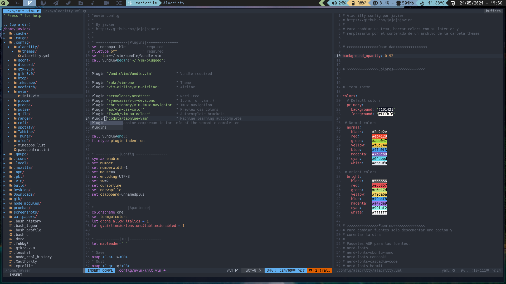

# Neovim config


this config use Vundle plugin manager, for installing Vundle is with
```bash
git clone https://github.com/VundleVim/Vundle.vim.git ~/.vim/bundle/Vundle.vim
```
soon ejecute this command in Neovim for install the plugins
```bash
:Plugininstall
```
