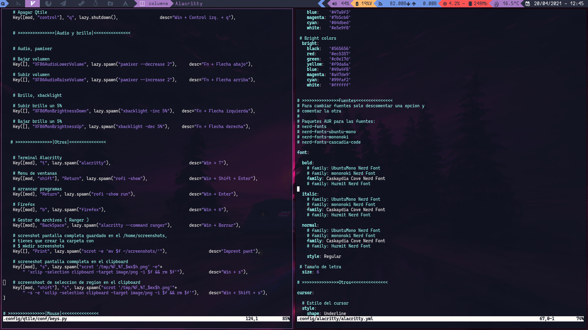
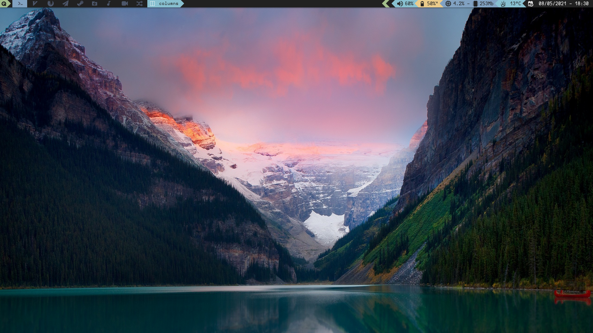

# dotfiles
my arch config qtile español

Paquetes. Necesitas un AUR helper para instalar las nerd fonts

```bash
nerd-fonts
nerd-fonts-ubuntu-mono
nerd-fonts-mononoki
nerd-fonts-cascadia-code
nerd-fonts-hermit
xbacklight
feh
rofi
firefox
pulseaudio pavucontrol pamixer
ranger
feh
```


