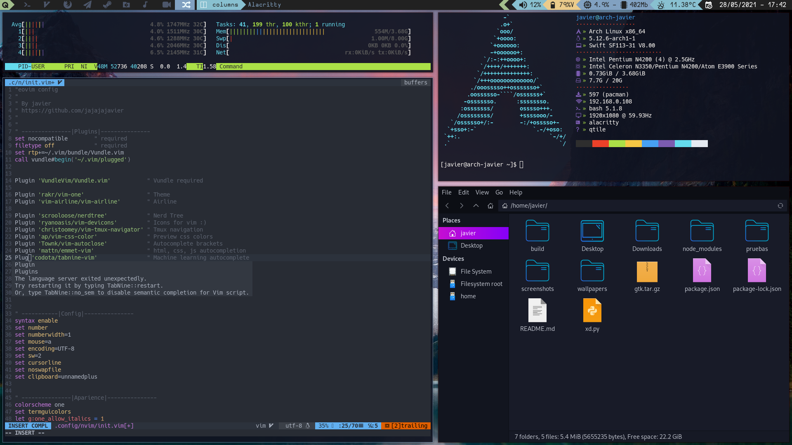

# Dotfiles
my qtile arch configs



Sorry my english so bad, i'm don't speak this language

##  Clone
if you don't have a ~/.config folder you need to create it
```bash
mkdir .config
```
clone my repo and paste in the ~/.config the content of my .config folder,
```bash
git clone https://github.com/jajajajavier/dotfiles
mv dotfiles/.config/* ~/.config
```

## packages

After installing Arch with a GRUB, Netwotk Manager and create a user,
for installing my config you need the following packages
```bash
sudo pacman -S base-devel git 
````
### Graphic drivers
about install the graphic drivers, see *[here](https://wiki.archlinux.org/title/Xorg#Driver_installation)* 
for shearch the packages for graphic drivers of your pc
```bash
sudo pacman -S [your graphics drivers]
```
install xorg for graphic server and xinit
```bash
sudo pacman -S xorg xorg-xinit
```
### Lightdm
you need lightdm for start qtile
```bash
sudo pacman -S lightdm lightdm-webkit2-greeter lightdm-webkit-theme-aether
```

### Apps
My apps       | info
------------- | -------------
Firefox       | Web browser
Thunar        | File manager
Rofi          | Menu
Scrot         | Screenshot
Picom         | Transparency
Lxappearance  | Manage gtk themes
Neovim        | Text editor
Feh           | Wallpaper
Vlc           | Media player
Alacritty     | Terminal
Qtile         | Window manager

i use firefox, if you use another web browser you can change after in the config file. 
```bash
sudo pacman -S firefox thunar rofi scrot picom lxappearance neovim feh vlc alacritty qtile
```
### Fonts
for the following packages you need a AUR helper, see *[here](https://wiki.archlinux.org/title/AUR_helpers)*
for info about the AUR helper. 

install the following fonts
```
[AUR] -S nerd-fonts
[AUR] -S nerd-fonts-ubuntu-mono
[AUR] -S nerd-fonts-mononoki
[AUR] -S nerd-fonts-cascadia-code
[AUR] -S nerd-fonts-hermit
[AUR] -S nerd-fonts-hack
```
### Audio 
```bash
sudo pacman -S pulseaudio pavucontrol pamixer
```

## Configuring

### Xprofile
first create the .xprofile file
```bash
touch .xprofile
nvim .xprofile
```
in the .xprofile file writhe this
```bash
picom &
setxkbmap [you keyboard distribution] &
~/.fehbg &
```
### gtk
in my dotfiles 

### Enable lightdm 
you can start qtile, for this you need enable lightdm
```bash
systemctl enable lightdm
```
and reboot
```
reboot
```
### Wallpaper
