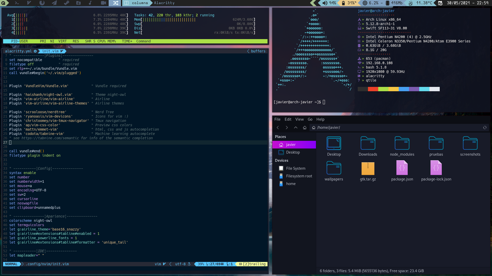

# Dotfiles
my qtile arch configs



Sorry my english is very bad, i'm don't speak this language

##  Clone
if you don't have a ~/.config folder you need to create it
```bash
mkdir .config
```
clone my repo and paste in the ~/.config the content of my .config folder,
```bash
git clone https://github.com/jajajajavier/dotfiles
mv dotfiles/.config/* ~/.config
```

## packages

After installing Arch with a GRUB, Netwotk Manager and create a user,
for installing my config you need the following packages
```bash
sudo pacman -S base-devel git 
````
### Graphic drivers
about install the graphic drivers, see *[here](https://wiki.archlinux.org/title/Xorg#Driver_installation)* 
for shearch the packages for graphic drivers of your pc
```bash
sudo pacman -S [your graphics drivers]
```
install xorg for graphic server and xinit
```bash
sudo pacman -S xorg xorg-xinit
```
### Lightdm
you need lightdm for start qtile
```bash
sudo pacman -S lightdm lightdm-webkit2-greeter lightdm-webkit-theme-aether
```

### Apps
My apps       | info
------------- | -------------
Firefox       | Web browser
Thunar        | File manager
Rofi          | Menu
Scrot         | Screenshot
Picom         | Transparency
Lxappearance  | Manage gtk themes
Neovim        | Text editor
Feh           | Wallpaper
Vlc           | Media player
Alacritty     | Terminal
Qtile         | Window manager

i use firefox, if you use another web browser you can change after in the config file. 
```bash
sudo pacman -S firefox thunar rofi scrot picom lxappearance neovim feh vlc alacritty qtile
```
### Fonts
for the following packages you need a AUR helper, see *[here](https://wiki.archlinux.org/title/AUR_helpers)*
for info about the AUR helper. 

install the following fonts
```
[AUR] -S nerd-fonts
[AUR] -S nerd-fonts-ubuntu-mono
[AUR] -S nerd-fonts-mononoki
[AUR] -S nerd-fonts-cascadia-code
[AUR] -S nerd-fonts-hermit
[AUR] -S nerd-fonts-hack
```
### Audio 
```bash
sudo pacman -S pulseaudio pavucontrol pamixer
```

## Configuring
for screenshots create the screenshot folder
```bash
mkdir screenshot
```
see *[here](.config/nvim/README.md)* for configuring Neovim

### Xprofile
first create the .xprofile file
```bash
touch .xprofile
nvim .xprofile
```
in the .xprofile file writhe this
```bash
picom &
setxkbmap [you keyboard distribution] &
~/.fehbg &
```
### gtk
in my dotfiles there is a tar.gz file with themes and icons gtk, 
extract the tar.gz and move the content
```bash
cd dotfiles
tar -xvf gtk.tar.gz
sudo mv icons/* /usr/share/icons
sudo mv themes/* /usr/share/icons
```

### Enable lightdm 
you can start qtile, for this you need enable lightdm
```bash
systemctl enable lightdm
```
and reboot
```
reboot
```
### Wallpaper and gtk 
open a terminal with windows + enter and open firefox with
windows + B

from internet you can download a wallpaper :) and use it 
```bash
feh --bg-scale /route/of/wallpaper
```
with lxappearance you can change the gtk theme , open lxappearance with rofi, 
open rofi: windows + Backspace
and change the theme, icon and cursor 

### Local temperature, CPU and RAM consume
for obtain local temperature you need edit the widget file in ~/.config/qtile/conf/widget.py.
in the widget.OpenWeather section change the value of cityid, the city id
is obtain *[here](https://openweathermap.org/)*, search your city open the info and look the 
numbers in the url,
```bash
https://openweathermap.org/city/[numbers]
```
change the cityid value for you numbers
```bash
cityid='[NUMBERS]'
```
the widget for the consume of CPU and Ram need the psutil
```bash
sudo pacman -S psutil
```
# Finish
Ready, you have my cofig, thanks.
you can edit the config files :)

# my keybindigs:

## Qtile

keys                  | Info
----------------------|-----------------
Win + Numbers         | Change workspace
Win + Shift + Numbers | Move window to another workspace
Win + Shift + Tab     | Change window orientation
Win + Shift + H       | Move window to left
Win + Shift + J       | Move window to down
Win + Shift + K       | Move window to up
Win + Shift + L       | Move window to left
Win + control + H     | Resize window to left
Win + control + J     | Resize window to down
Win + control + K     | Resize window to up 
Win + control + L     | Resize window to left
Win + supr            | Resize windows to normal size
Win + H               | Change focused window to left
Win + J               | Change focused window to down
Win + K               | Change focused window to up
Win + L               | Change focused window to left
Win + Tab             | Alt tabing
Win + supr            | Resize windows to normal size
Win + q               | Close the focused window
Win + Shift + Space   | Bring window to front or place on tiling
Win + F11             | Fullscreen
Win + control + R     | Restart Qtile
Win + control + Q     | Close Qtile

## Audio and brightness

keys         | Info
-------------|-----------------
fn + Up      | Increase volume        
fn + Down    | Decrease volume
fn + Left    | Increase Brightness
fn + Right   | Decrease Brightness

## apps

keys                    | Info
------------------------|-----------------
Win + Enter             | Terminal
Win + Shift + Backspace | Windows menu
Win + Backspace         | Menu
Win + B                 | Browser
Win - F                 | File manager
Imprent pant            | Screenshot saved 
Win + S                 | Screenshot in the clipboard
Win + Shift +S          | Screenshot of selected area in the clipboard

